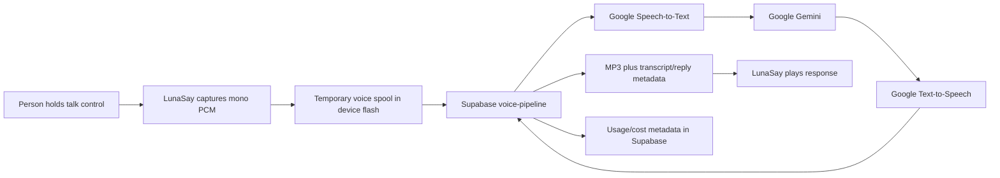

# LunaSay privacy and data flow

**Implementation audit:** July 18, 2026
**Applies to:** `astrolabe175c` built with
`ASTROLABE175C_VARIANT=lunasay` and the current Supabase `voice-pipeline`
**Status:** engineering disclosure; not yet approved campaign policy

This describes what the current source does. Items marked **launch blocker**
must be resolved or disclosed before publication. Future intent is not current
behavior.

## Deliberate voice flow

The campaign interaction has no wake-word claim. Capture starts with an
explicit physical action. Captured audio is sent when the device completes a
voice turn.

## Data sent for a voice turn

The device request contains mono PCM speech at 16 kHz, current face slug,
active voice/faculty identifiers, the face/system instruction,
interaction/Commonplace modes, response
format, language/sample-rate metadata, and authentication headers.

The service derives a transcript, sends prompt text to Gemini, and sends the
bounded reply to Google TTS. It returns MP3 audio plus transcript, reply, route,
face, and voice/faculty metadata in JSON or HTTP headers.

### Synastry

The LunaSay build no longer appends ESP-NOW wellness biometrics to ordinary
Synastry voice prompts. Birth records are used locally to draw chart and
synastry faces; the generic voice request does not serialize the birth record
itself. The spoken question, face slug, system instruction, and conversation
history still enter the cloud path.

### Daily reading continuity

LunaSay keeps two rotating full daily packet slots plus a separate seven-day
summary in the existing voice-cache partition. When a new day is generated,
firmware may send the recent local dates and, for Moon, Astrology, Transits,
Synastry, Tarot, and Sky only, each server-generated `headline`, `action`, and
a SHA-256 fingerprint of `evidence`. Prior evidence text is not retransmitted.
The summary is rebuilt from the validated packet fields before every write and
read; it never includes journal or conversation text, mood, biometrics,
birth/family records, location, settings, or user-authored notes.

The service accepts only summaries from the preceding 14 days, discards
unknown faces and malformed or oversized fields, de-duplicates dates, retains
at most seven valid days, and supplies each face's history only to that face's
independent Gemini 2.5 call. The server compares the newest fingerprint with
today's server-selected evidence and tells Gemini only whether it changed;
Gemini does not receive prior evidence text. Continuity is never support for
today's claim. The prompt permits a developing thread only when the supplied
sequence supports it, forbids invented lived events, and rejects a practice
that exactly repeats any retained day. The application does not persist this
continuity envelope server-side; provider-retention caveats below still apply.

### Ask This Face follow-ups

When a person deliberately asks a spoken question from a reflective face, the
device supplies bounded face-local context with the audio request. For the six
daily generated faces, this may include the current local day's cached spoken
reading, its exact server-validated supporting evidence, optional
weather/timing evidence, and the validated practice. The context is read from
the device's rotating daily packet; it does not cause another daily generation
call. A cached Family Synastry weather-evidence line is omitted when it contains
live family measurements. Cycle and Partner Wellness follow-ups disclose only
that relevant device-local signals are available; their raw measurements and
partner identity remain off the cloud follow-up request.

The request labels cached text as reference data rather than instructions and
requires the service to answer the person's exact question, state when the
supplied evidence cannot support a claim, and avoid certainty, diagnosis,
compatibility scoring, and event prediction. It does not add raw birth
records, coordinates, credentials, journal text, conversation history,
current audio from another turn, or hidden settings. Conversation, Journal,
Alethiometer, and Crystal Ball do not inherit a daily face's cached context.
The spoken question and the bounded context still enter the cloud voice path
and remain subject to the provider-retention caveats below.

### Relationship Weather Time Travel

The companion PWA reads only the names and roles of family profiles already
stored on the connected LunaSay, the selected profile slot, and a compact
ten-condition symbolic weather arc. Birth dates, birth times, coordinates,
chart positions, aspects, biometrics, and family-repository credentials are
not exposed to the PWA. Choosing another family member or date is a local BLE
settings operation and is not persisted across a reboot.

The device calculates the selected date and following ten days locally. The
physical Synastry face shows the same selection. If the user deliberately
requests a spoken reading from that face, the existing voice request contains
the selected civil date and bounded chart-derived facts. Present-day
biometrics are explicitly excluded from past or future readings because they
are not evidence about another date. The feature is framed as symbolic
reflection, never compatibility scoring or event prediction.

### Device health and OTA telemetry

The Web Bluetooth settings read and a separate, bounded, read-only health
characteristic expose an operational snapshot to the connected browser:
firmware version, uptime, battery presence, percentage, voltage and
charging/USB state, BLE enabled/advertising state, the configured Wi-Fi SSID,
and automatic OTA activity, readiness, interval, last-poll uptime, and a
bounded last-result summary. These are read directly from LunaSay and rendered
on the Device tab. The PWA does not upload or persist the snapshot.

The snapshot does not contain Wi-Fi passwords, device-auth secrets, signed
manifest credentials, birth/family records, journal or conversation text, raw
audio, or OTA signing material. Location and ring measurements remain in the
existing settings response because their explicit companion features need
them; they are not included in the new `device` telemetry object.

### Alethiometer

The transcribed question reaches Gemini twice: first to select three distinct
question symbols, then with those fixed symbols to select a distinct answer
symbol and spoken reflection. Google TTS receives the reflection. The device
receives four symbol indices, spoken text, and audio.

## Data stored on the device

### Birth and family profiles

Up to eight secondary profiles plus one primary profile are stored as NVS blobs
in the `astro` namespace. Records contain name, role, birth date and time,
latitude, longitude, UTC offset, birthplace label, and validity. The active
Synastry slot and optional Castalia family-repository identifier are also in
NVS.

The LunaSay production variant no longer contains or seeds the developer
family's names or birth records. A fresh device remains empty until its owner
configures profiles or a Castalia family repository. Existing NVS survives an
app-only update.

NVS encryption is not enabled in the current build. Someone with sufficient
physical/debug access may be able to recover records. **Launch blocker:** enable
and validate encrypted storage or disclose this limitation and define the
production key/provisioning model.

### Conversation history

The LunaSay variant clears inherited `faculty` history at boot and does not
append new transcript/reply pairs. Its independent reflective turns therefore
do not persist or resend conversational text history. Other firmware profiles
retain their existing bounded-history behavior.

**Verification required:** inspect the release candidate's NVS and successive
network requests, and cover the legacy namespace in factory reset.

### Temporary audio

The `voice_spool` flash partition holds capture scratch and response audio.
Capture files are removed on normal completion and many error/cancel paths;
response files are reused by later turns. File removal is not secure erasure.

**Launch blocker:** verify crash/power-loss cleanup, maximum residence time, and
factory-reset coverage.

### Wi-Fi and settings

Known Wi-Fi credentials and device settings are stored in unencrypted NVS and
must be included in the production reset and provisioning threat model.

## Server-side storage and logs

### Commonplace

Ordinary LunaSay face questions now request `commonplaceMode: "off"` and
`logToCommonplace: false`; they do not intentionally create a Directus
Commonplace entry. Explicit Notes/journal behavior in other profiles may store
transcript content by design. This request policy does not mean third-party
processors retain nothing.

When `LUNASAY_GITHUB_REPO` and a write token are configured, the voice service
can also append journal and conversation text to daily Markdown files in that
repository. That path contains raw user text and is separate from the
pseudonymous research-event stream below. It must target a private,
user-authorized repository and remain disabled unless the user has deliberately
enabled journaling or conversation logging.

### Usage metering

Supabase `voice_usage_events` stores user ID when resolvable, service, route,
source, face, faculty slug, model, voice, language, audio seconds/bytes,
estimated token counts, character counts, estimated cost, and creation time.
The usage-event insert has no raw-audio, transcript, or reply field.

### Mood check-ins, reading feedback, and optional research export

The Mood Check-in face stores the current friendly label plus its valence and
arousal coordinates in device NVS. Mood is self-reported present-moment
context; prompts must not treat it as proof that an astrological reading is
correct or infer another family member's mood from it.

The hosted PWA exposes a separate Research sharing switch. Enabling it requires
an explicit confirmation and stores consent version `research-v2` on the
device. The Mood Check-in face presents six small facial choices that can be
tapped directly; the large face previews the selected expression, and tapping
that large face deliberately records the check-in. The device
retains at most one unsent structured contribution and retries after
connectivity returns. Turning sharing off stops new exports and erases that
unsent contribution. Consent recorded under an earlier policy version is
disabled and must be granted again.

The PWA can also submit one structured rating for a daily Moon, Astrology,
Transits, Synastry, Tarot, or Sky reading. The rating is one of `helpful`,
`mixed`, or `missed`. No note or reading text is accepted. Rating works whether
or not research sharing is enabled.

LunaSay keeps a bounded, decaying count of the three ratings for each face in
device NVS. At daily generation time, those counts accompany the existing
signed voice-pipeline request. The server validates the small numeric envelope
and supplies only the matching face's counts to that face's Gemini call as
writing calibration. A rating may make a future reading more concrete, modest,
or explicit about uncertainty; it is never chart evidence or evidence about
the user's life. LunaSay application code does not persist this preference
envelope server-side; provider-retention caveats below still apply.

When research sharing is enabled, the device may separately forward only the
face, rating, local reading date, source, and event time to `lunasay-event`.
With research sharing disabled, no rating event is exported.

The `lunasay-event` endpoint accepts a mood or reading-feedback event only with
an affirmative consent flag, the exact current consent-policy version, an
allowlisted source, bounded fields, and a valid signed credential from a
provisioned Astrolabe. It derives the subject from the provisioned owner ID
when one exists, otherwise from the verified device MAC; it does not trust a
client-supplied subject. Research export is off
unless the operator deliberately sets `LUNASAY_ML_LOGGING_ENABLED=true`, a
private GitHub repository, and a server-only subject salt. Exported JSONL uses
a salted SHA-256 subject identifier and event-specific allowlisted fields. It
does not include names, reading text or evidence, free-text notes, journal
text, conversations, birth data, family data, location, or raw biometrics.

This remains an incomplete consent product. Participation and prospective
revocation are now exposed, but **launch blockers** remain: obtain review of
the consent text, publish retention and repository-access policy, add
retrospective deletion/data-export requests, and verify that the production
repository is private. Do not enable the environment flag before those items
are complete.

### Runtime logs

Current device debug/QA logs can include clipped or full transcripts and
replies. The explicit QA command prints both to serial so the harness can
verify them. Shared audio-pipeline logs can print an early transcript segment.

**Launch blocker:** production builds must suppress content logs by default and
require deliberate, time-bounded diagnostic consent before emitting them. Do
not claim content-free diagnostics until the production binary and captured
logs prove it.

### Provider retention

The repository does not establish Google or Supabase contractual retention
periods. **Launch blocker:** record provider terms, settings, regions,
retention/deletion behavior, subprocessors, and responsibility for privacy
requests. Absence of an application content row does not prove zero retention.

## Local setup interface

The device serves `/family`, `/settings`, and JSON APIs over HTTP on its local
network. The family API reads and writes complete birth records. The embedded
PWA is same-origin and the API no longer grants permissive cross-origin access,
but it still has no pairing token or authenticated session.

The family page can ask the browser—not the device—to query OpenStreetMap's
Nominatim service after the user presses the lookup button. That sends the
typed birthplace to OpenStreetMap. Results are not stored until Save.

**Launch blocker:** add a short-lived pairing code or equivalent local
authorization, protect writes, and test hostile/shared Wi-Fi. Until fixed,
describe it as a prototype interface, not a secured PWA.

## Network transport

The hosted voice path uses the ESP-IDF certificate bundle for HTTPS. Firmware
no longer constructs an automatic plaintext downgrade URL when HTTPS fails. A
developer can still compile an explicit `MYNAH_VOICE_HTTP_URL` for a local lab
relay; such a build is unacceptable for campaign privacy claims or fulfillment.

**Launch blocker:** preserve a release-candidate network trace showing URLs and
TLS behavior, confirm no secret or speech travels over plain HTTP, and test
certificate/time failure. The local settings server remains HTTP and is covered
by the authorization blocker.

## Current controls

| Control | Current implementation | Campaign status |
|---|---|---|
| Start microphone | Deliberate physical interaction | Demonstrable |
| Commonplace storage for ordinary LunaSay voice | Off in request metadata | Build-verified; network verification required |
| Add/edit/remove profiles | Local `/family` page | Prototype; authorization blocker |
| Select Synastry profile | Local `/family` page | Prototype; authorization blocker |
| Conversation history | Cleared and not appended by LunaSay | NVS/network verification required |
| Erase profiles, Wi-Fi, legacy history, and audio scratch | Partial mechanisms | Complete reset evidence missing |
| Persistent microphone lockout | Not proven by this audit | Do not claim |
| Research participation and stop-new-sharing control | Hosted PWA + device NVS | Implemented; consent copy/legal review required |
| Data export | Not proven by this audit | Do not claim |

## Campaign-safe wording today

> LunaSay listens during a deliberate hold-to-talk interaction. Spoken
> questions use cloud speech recognition, language interpretation, and speech
> synthesis. Ordinary LunaSay questions are configured not to create a
> Commonplace entry, and the LunaSay variant does not retain conversation text
> history. Birth profiles remain in device NVS for local chart
> rendering unless the owner configures family-repo sync. We are completing
> storage encryption, local setup authorization, content-free production
> logging, deletion, and provider-retention validation before fulfillment.

Do not shorten this to “everything stays local,” “we store nothing,” “encrypted
end to end,” or “private by design” until release evidence exists.

## Evidence required to close this document

- [ ] Production NVS encryption and provisioning report
- [ ] Factory-reset test covering profiles, repository ID, history, Wi-Fi,
  credentials, audio scratch, settings, and authentication material
- [ ] Local settings authorization test
- [ ] Release-candidate network trace and endpoint inventory
- [ ] Production diagnostic log review with private content absent by default
- [ ] Provider/subprocessor retention and deletion record
- [ ] Plain-language first-use consent screen and photograph
- [ ] Visible history deletion and microphone lockout tests
- [ ] Final-binary local/cloud matrix
